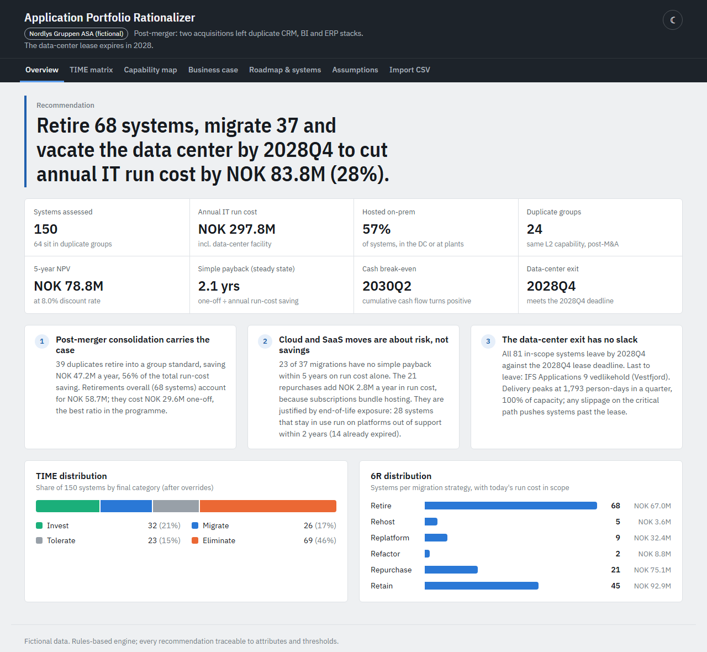
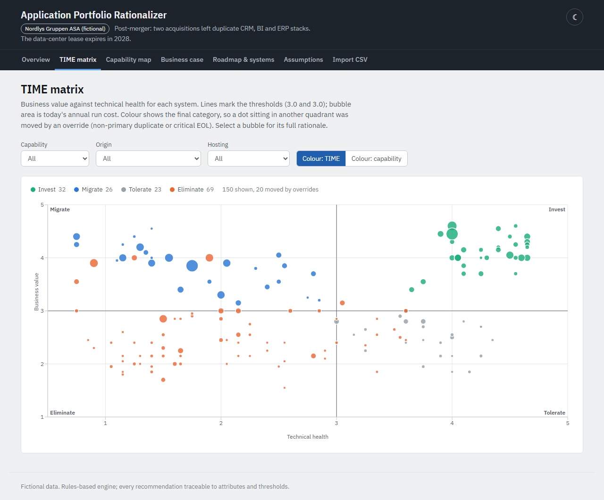
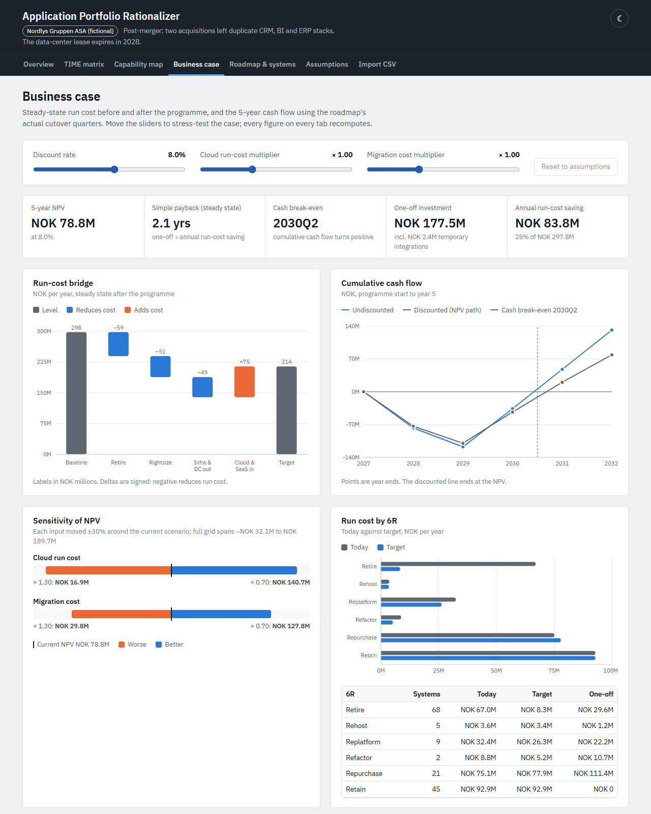
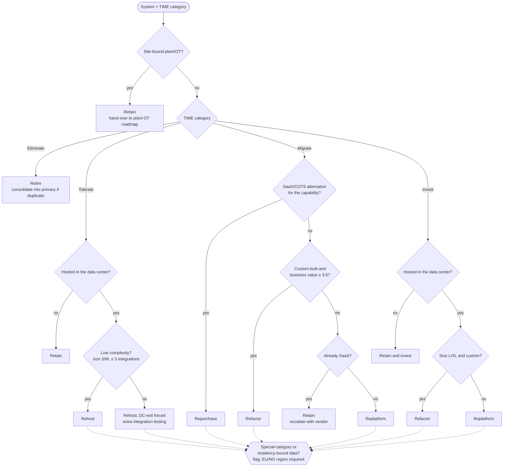
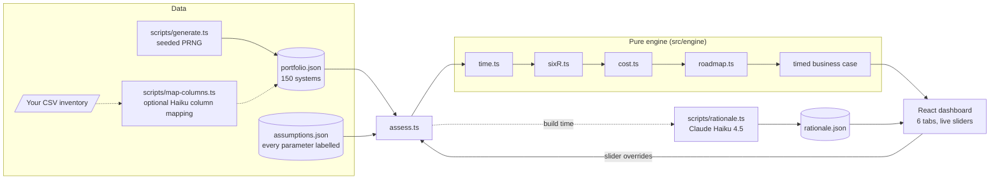

# Application Portfolio Rationalizer

**Give it an application inventory; get a traceable TIME/6R decision per system, a cloud business
case and a dependency-aware migration roadmap — reproducible, auditable, recomputed live.**

- **Classifies** every system with Gartner's TIME model (Tolerate / Invest / Migrate / Eliminate)
  and a 6R migration strategy (Rehost, Replatform, Refactor, Repurchase, Retire, Retain) using an
  explicit, tested rules engine.
- **Prices** the change: baseline TCO → target run cost per 6R, one-off migration cost, simple
  payback, cash break-even quarter, 5-year NPV and a ±30 % sensitivity grid.
- **Plans** the programme: quarterly cutovers on a dependency graph with cycle breaking, capacity
  limits and validation against a hard data-center exit date, presented as calendar horizons.
- **Explains** itself: every decision carries a rule trace (`rationale[]`); an LLM (Claude Haiku
  4.5) rewrites that trace into CIO-readable prose at build time — it never makes the decision.



| TIME matrix | Business case with live sliders |
|---|---|
|  |  |

The demo portfolio is **Nordlys Gruppen ASA — a fictional** Norwegian industrial group (~4 000
employees) that acquired two companies in 2022 and 2024 and runs a leased data center whose lease
expires in 2028. 150 systems, generated from a fixed seed with planted patterns: duplicates across
the acquired entities, end-of-life platforms, shadow IT and business-critical legacy.

## The case in numbers

Default assumptions, computed by the engine. All figures are illustrative estimates for a fictional
company.

| Metric | Value |
|---|---|
| Systems assessed | 150 (64 in 24 duplicate groups) |
| Annual IT run cost today → target | NOK 297.8M → NOK 214.0M (−NOK 83.8M, −28 %) |
| One-off investment | NOK 177.5M (incl. NOK 80M core ERP programme) |
| 5-year NPV at 8 % | NOK 78.8M (sensitivity range −NOK 32.1M to +NOK 189.7M) |
| Simple payback (steady state) | 2.1 years (one-off ÷ annual run-cost saving) |
| Cash break-even | 2030Q2 (cumulative undiscounted cash flow turns positive, using the roadmap's timing) |
| Decisions | 68 Retire · 45 Retain · 21 Repurchase · 9 Replatform · 5 Rehost · 2 Refactor |
| Data-center exit | All 81 in-scope systems out by 2028Q4 — on the deadline, zero slack |
| Where the money is | Consolidating 39 duplicates delivers 56 % of the saving for 16 % of the one-off |

## Method

### 1. TIME scoring

Each system gets two scores on a 1–5 scale, with weights and thresholds in
[`data/assumptions.json`](data/assumptions.json):

- **Business value** = 0.25 × functional coverage + 0.15 × user satisfaction + 0.30 × strategic
  relevance + 0.30 × business criticality.
- **Technical health** = 0.25 × supportability + 0.25 × security + 0.15 × scalability + 0.10 ×
  documentation + 0.25 × EOL risk, **minus an EOL penalty** (−0.5 if the platform is already out of
  support, −0.25 if it expires within 2 years).

Both thresholds are 3.0 (inclusive): high/high → **Invest**, high value/low health → **Migrate**,
low/high → **Tolerate**, low/low → **Eliminate**. Two explicit overrides are then applied and
logged in the system's `rationale[]`:

1. **Non-primary duplicate → Eliminate.** Systems in the same L2 capability that overlap
   functionally form a duplicate group with one designated primary (the group standard); every other
   member is consolidated into it.
2. **Critical EOL → at least Migrate.** Platform EOL within 2 years and business criticality ≥ 4.

When both apply, **consolidation takes precedence**: migrating a platform that is about to be
consolidated away wastes money. The system is still flagged `critical_consolidation`, so its
retirement is planned as a real migration project behind the primary, not a switch-off (9 systems in
the demo, including two integration middlewares and the acquired company's ERP). When the group
standard is itself being repurchased, replatformed or refactored, the duplicate consolidates into its
**future state** and is scheduled after that goes live: Dynamics NAV moves into the group ERP (SAP ECC
→ S/4HANA-class SaaS replacement, go-live 2028Q2), not onto ECC. Shadow-IT systems
get a governance flag, but their category follows the scores, not their origin.

### 2. 6R decision tree

A decision tree, not a lookup table — the same TIME category leads to different strategies
depending on hosting, system type, complexity and the market:



### 3. Cost model

- **Baseline TCO** per system = licence + infrastructure + internal support (FTE × loaded cost) +
  vendor support, plus an NOK 18M/yr data-center facility cost that disappears only if the DC is
  actually vacated.
- **Target run cost** applies per-6R factors to each cost line (e.g. replatform: infra × 0.7 as cloud
  run cost, support × 0.75). Repurchase replaces licence and infra with a SaaS subscription;
  consolidation adds an uplift on the primary for the absorbed users.
- **One-off cost** = rate card (6R × size class) × integration-complexity multiplier (+8 % per
  integration, capped at 2×) × price multiplier, plus consolidation cost for data/user migration.
  The group ERP is costed as a **programme** (NOK 80M estimate) rather than a rate-card line, because
  an ECC → S/4-class transformation is not a large application swap.
- **Business case**: quarterly cash flows use the roadmap's actual start and cutover quarters,
  giving the cash break-even quarter, 5-year NPV and a 3 × 3 sensitivity grid (cloud run cost ×
  migration cost, ±30 %). **Simple payback** is the steady-state ratio one-off ÷ annual saving; **cash
  break-even** is when cumulative undiscounted cash flow turns positive. They differ because savings
  only start at each system's cutover.

### 4. Roadmap

1. **Migration tracks** set scheduling priority by migration type: retire (quick wins), rehost
   (≤ 3 integrations) and consolidation, replatform, refactor and repurchase. Consolidations follow
   their primary. A track is not a calendar period: long refactor and repurchase projects start early
   and run in parallel with switch-offs.
2. **Topological ordering** on the integration graph: a system moves after its dependencies, or
   gets a *temporary integration* (bridge, 10 person-days) to a dependency that moves later.
3. **Cycle breaking**: dependency cycles are cut one edge at a time by a stated rule — prefer an edge
   touching a retained system (no bridge needed), then the lowest-criticality dependency, then the one
   moving latest. Every cut is reported with its cycle and whether it needs a bridge (6 cycles in the
   demo, 3 bridged).
4. **Capacity**: at most 12 cutovers and 1 800 person-days per quarter, 400 person-days per system
   per quarter; light SaaS switch-offs use a separate lane; the ERP programme runs on its own team
   and draws 15 % of its effort from the shared pool.
5. **DC-exit validation**: systems in the closing data center are scheduled first; the result lists
   every system that is retained in, unscheduled for, or late for the 2028Q4 milestone.
6. **Calendar horizons** for presentation (Gantt and memo), by cutover quarter: **H1 2027Q1–Q3** quick
   wins (41 cutovers), **H2 2027Q4–2028Q4** transform and data-center exit (59), **H3 2029** close-out
   (5). The boundaries are a labelled assumption (`roadmap.horizonEnds`).

## Architecture



- **`assess.ts`** is the single entry point: TIME → 6R → cost → roadmap → business case timed by the
  roadmap. It is a pure function of `(portfolio, assumptions)`, so the dashboard recomputes the whole
  chain in the browser whenever a slider (discount rate, cloud run-cost factor, migration-cost
  multiplier) moves.
- **Build-time AI**: `npm run rationale` sends each system's attributes and the engine's decision
  to Haiku and stores a 2–3 sentence explanation in `data/rationale.json`. A test checks that each
  text names the correct TIME category and 6R strategy. No API key ever reaches the frontend.
- **Bring your own inventory**: a CSV import (in progress) maps a messy export onto the schema — with
  an optional Haiku-assisted column mapping that the user confirms before the engine runs.
- Static site: Vite + React + TypeScript + Recharts. No server, no database.

## Design principles

- **Rules decide, AI explains.** Classification, costing and scheduling are deterministic; the
  language model only turns the rule trace into prose and is not allowed to change the decision.
- **Every recommendation is traceable.** Each system carries `rationale[]` entries for TIME, 6R,
  cost and roadmap — scores against thresholds, overrides applied, rate card lines, why it waits.
- **Every number is labelled.** All 58 parameters in `assumptions.json` carry a unit, a description
  and either a source or `"estimate": true` with a written rationale; the Assumptions tab shows them.
  In this demo all 58 are estimates.
- **Deterministic and reproducible.** Fixed generator seed, deterministic tie-breaks in graph
  algorithms; the same inputs always give the same plan.
- **Pure functions.** No hidden state in the engine, which makes it testable (vitest suite covering
  every TIME quadrant and override, every 6R branch, hand-calculated cost cases, cycles and
  capacity overflow) and lets the UI recompute live.

## Quick start

Requires Node 20.19+ (22 LTS recommended).

```bash
npm install
npm run dev          # dashboard at http://localhost:5173
npm test             # engine, data and rationale tests (vitest)
npm run build        # typecheck + static build to dist/
npm run generate     # regenerate data/portfolio.json from the fixed seed
```

Optional, to regenerate the AI rationale text (≈150 Haiku calls, a few cents):

```bash
# .env.local
ANTHROPIC_API_KEY=sk-ant-...

npm run rationale                  # only systems whose inputs changed
npm run rationale -- --force       # all systems
npm run rationale -- --only SYS-011
```

## Project structure

```
src/
  model/      types.ts (data contract), data.ts (loads the JSON)
  engine/     time.ts, sixR.ts, cost.ts, roadmap.ts, graph.ts, assess.ts (+ *.test.ts)
  ui/         React dashboard: Overview, TIME matrix, Capability map, Business case,
              Roadmap & systems, Assumptions
data/         portfolio.json, assumptions.json, rationale.json
scripts/      generate.ts (seeded generator), rationale.ts (Haiku, build time)
docs/         executive memo (md + pdf), demo script, screenshots
```

## Limitations — and what a real client engagement would need

This is a method demonstrator, not a finished advisory product.

- **Inventory quality.** Real CMDB data is incomplete and inconsistent (owners, costs split across
  cost centres, integrations undocumented). A real engagement starts with data cleansing and
  interface discovery; the integration graph drives the whole roadmap.
- **Business fit comes from people, not fields.** Functional coverage, satisfaction and strategic
  relevance should come from structured stakeholder interviews and user surveys, and be calibrated
  across business units before thresholds mean anything.
- **Cost factors must be validated.** The 6R run-cost factors, rate cards and the ERP programme
  estimate are order-of-magnitude assumptions. They should be replaced with actual contracts,
  licence entitlements, cloud pricing for the sized workloads, and the client's own delivery rates.
- **Licences are negotiated, not calculated.** Consolidation and SaaS savings depend on contract
  terms, notice periods and enterprise agreements.
- **Organisational change is out of scope.** Training, process harmonisation after the
  acquisitions, operating-model changes and the capacity of the business to absorb change are not
  modelled beyond a delivery-capacity cap.
- **Single scenario.** The engine produces one plan per assumption set; it does not optimise across
  alternatives (e.g. a different primary per duplicate group) or model risk probabilistically.

## Disclaimer

Nordlys Gruppen ASA, its acquisitions, systems and all figures are **fictional and illustrative**.
Vendor and product names are used only to make the portfolio realistic; no statement about any real
product's cost or quality is intended.

---

